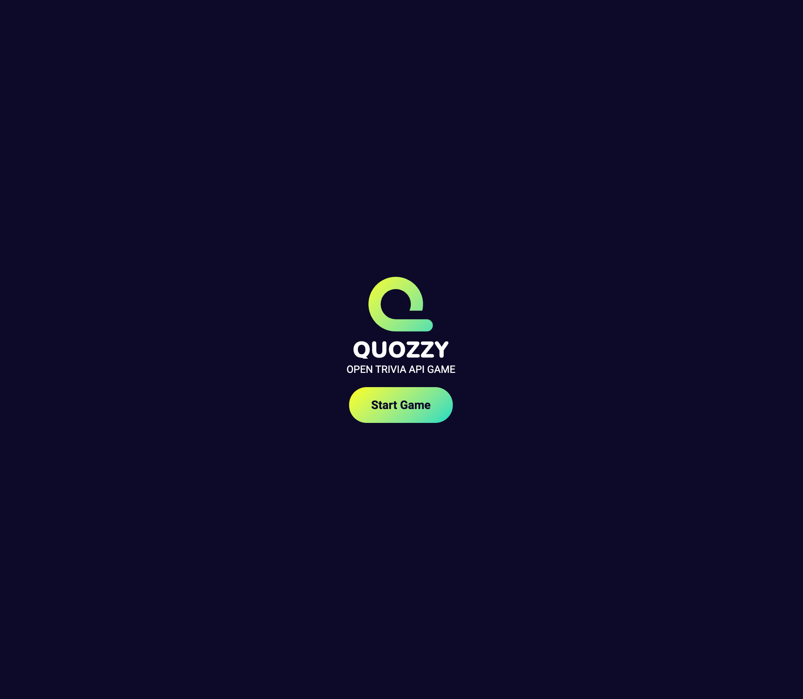
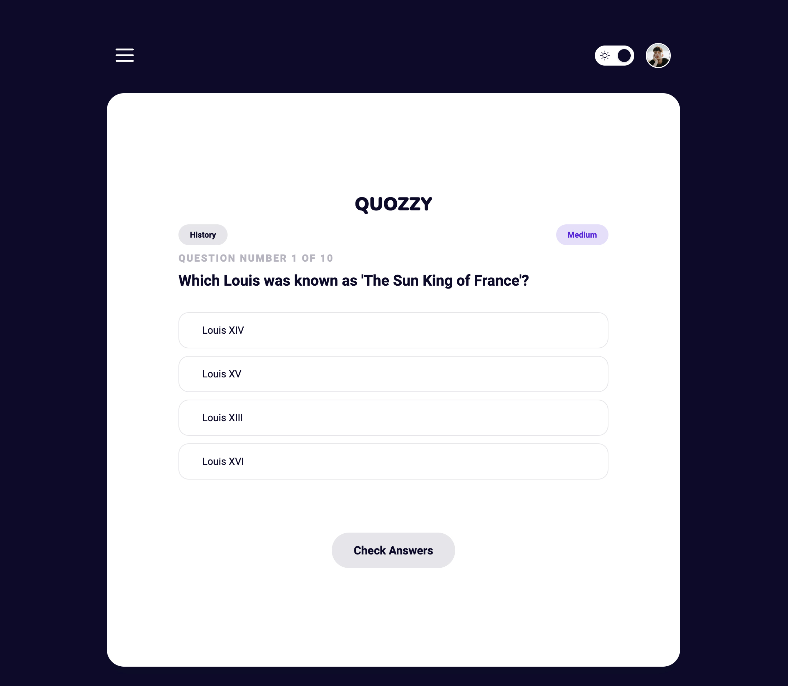
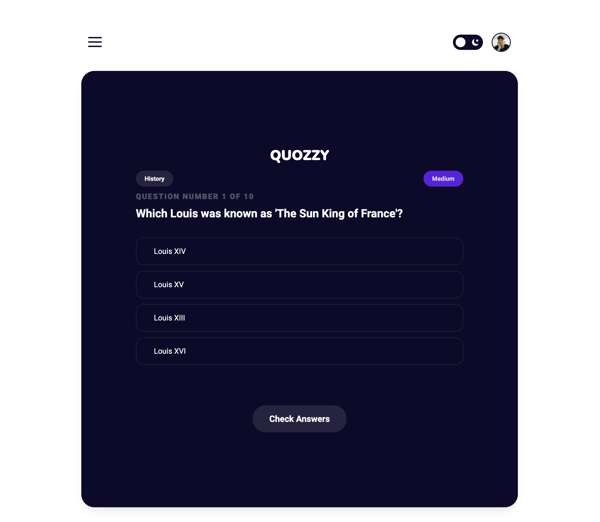
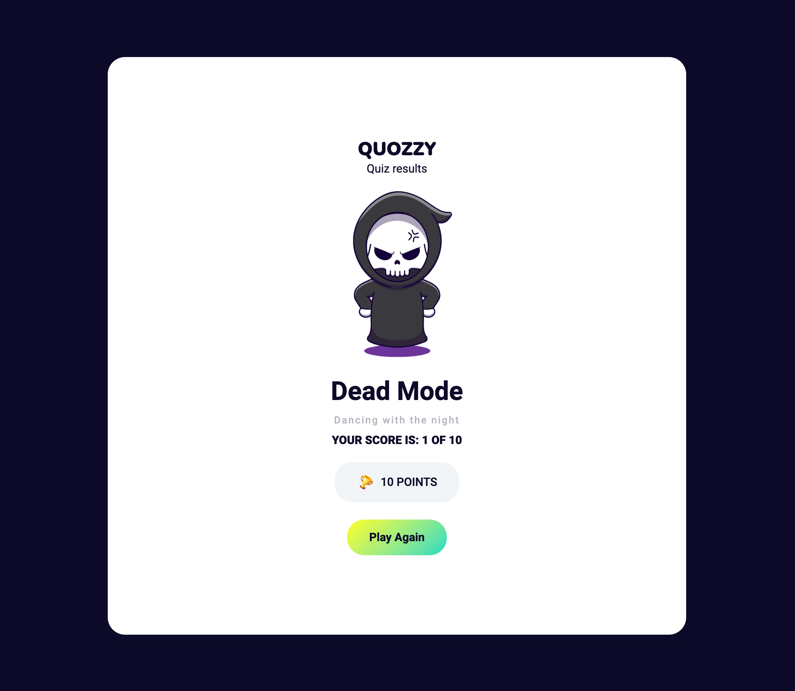
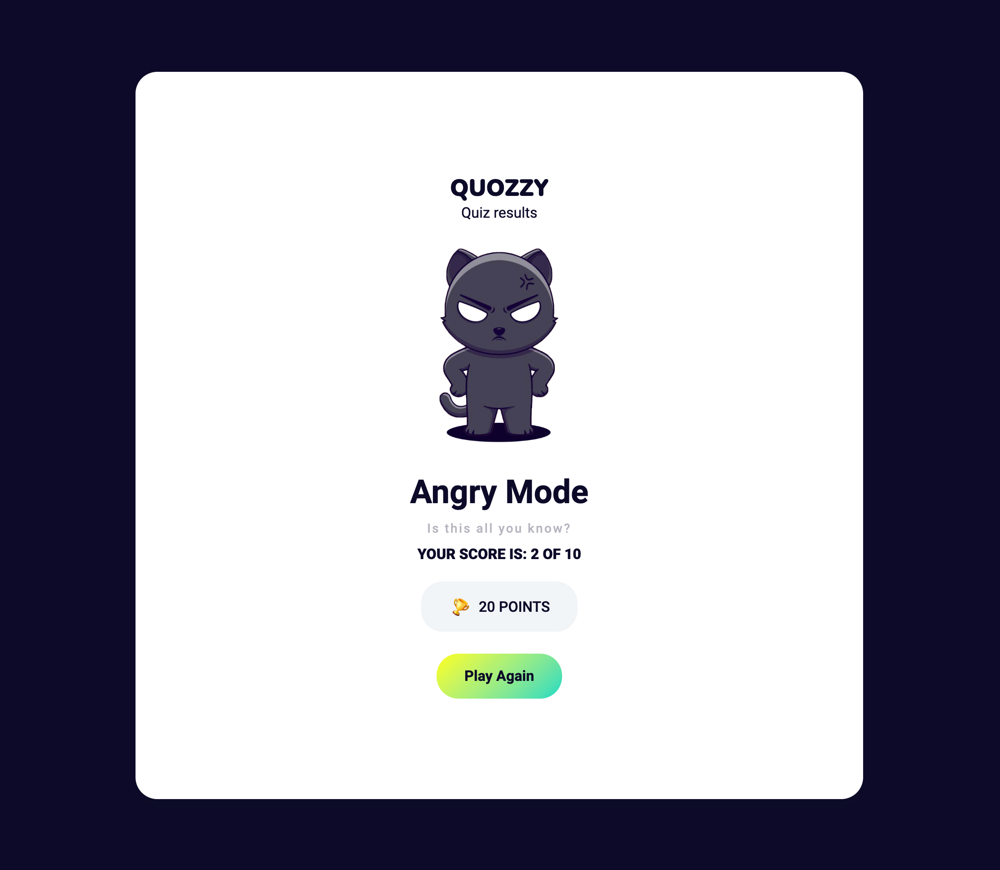
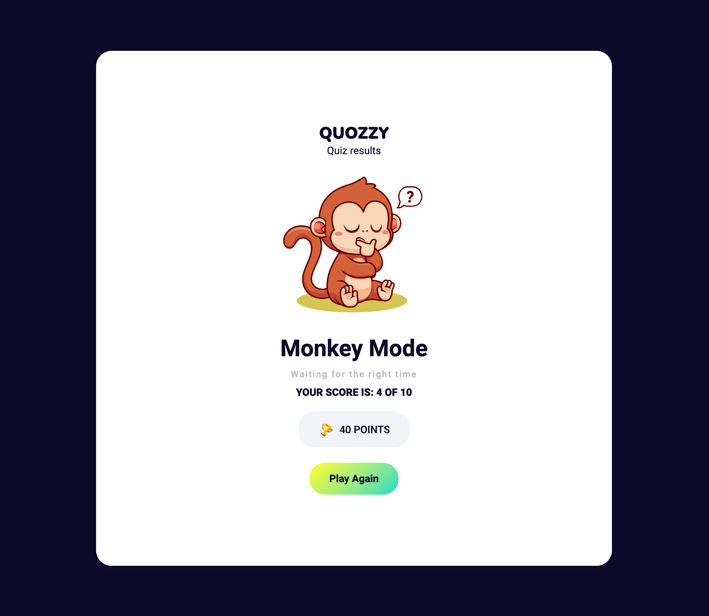
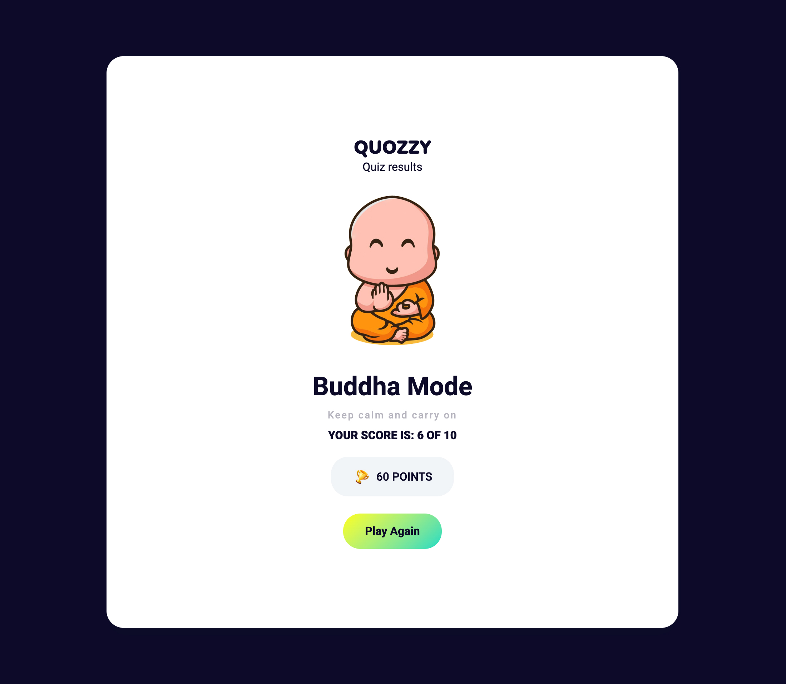
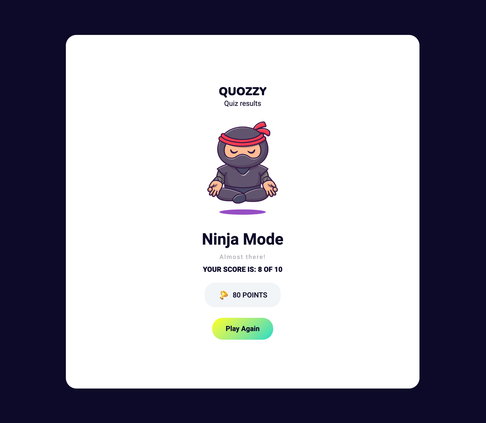
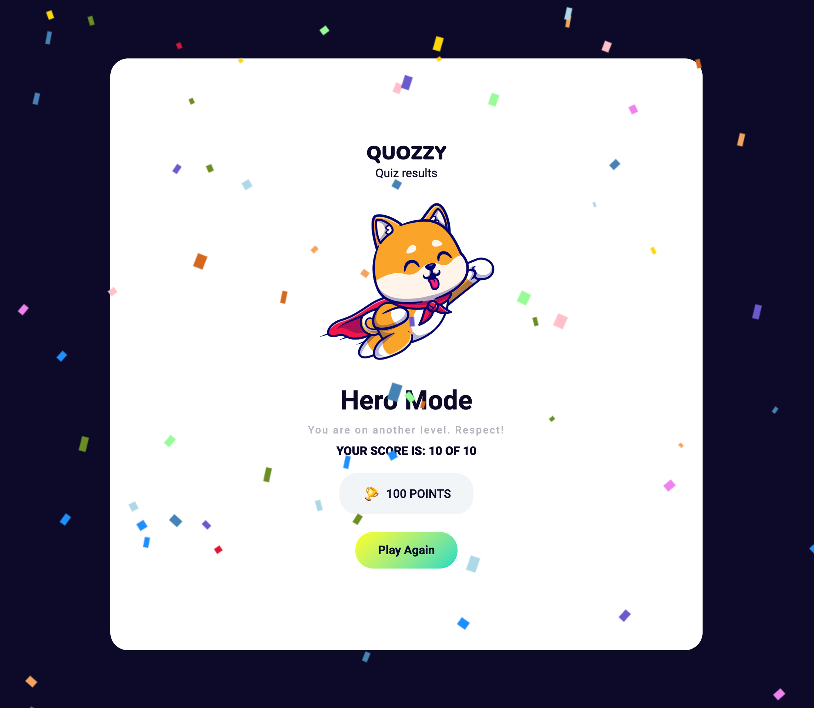

# Quozzy [Open Trivia API Database Game]

## Descripción

Como desarrollador junior frontend, mi motivación para crear este proyecto fue adquirir experiencia práctica en la conexión con una API externa y mejorar mis habilidades en JavaScript. Quería aplicar mis conocimientos teóricos en un proyecto real y desafiante.

Desarrollé este proyecto porque deseaba familiarizarme con el proceso de solicitar y recibir datos de una API, así como también trabajar con la estructura y el formato de los datos devueltos. Además, quería practicar la manipulación de datos y la presentación de información en el frontend.

El problema que resuelve este proyecto es brindar una plataforma interactiva donde los usuarios puedan recibir preguntas de trivia desde la API Open Trivia y ver las respuestas correspondientes. Esto proporciona una forma divertida y educativa de practicar conocimientos generales y poner a prueba las habilidades de los usuarios en un juego de trivia.

A través de este proyecto, aprendí cómo realizar solicitudes a una API utilizando JavaScript y cómo manejar la respuesta de la API para mostrar la información deseada en la interfaz de usuario. También gané experiencia en la manipulación y presentación de datos dinámicos, así como en el manejo de eventos y la interacción del usuario. Además, mejoré mi comprensión de los conceptos fundamentales de JavaScript y fortalecí mis habilidades de resolución de problemas y depuración. En resumen, este proyecto me permitió aplicar y reforzar mis conocimientos de frontend mientras desarrollaba una aplicación interactiva y entretenida.

## Instalación

No requiere ningún tipo de instalación.

## Uso

1. Clona este repositorio en tu máquina local.
2. Abre el archivo `index.html` en tu navegador web.
3. La aplicación cargará preguntas desde la API Open Trivia y las mostrará en la interfaz.
4. Elige la respuesta correcta y comprueba si has acertado.

## Demo

Puedes ver una demostración en vivo de este proyecto [aquí](https://example.com).

## Screenshots

Capturas de pantalla de la aplicación.

    Página de bienvenida.

    Página de del juego con el estilo claro.

    Página de del juego con el estilo oscuro.

    Página de resultados (0, 1 respuestas correctas)

    Página de resultados (2, 3 respuestas correctas)

    Página de resultados (4, 5 respuestas correctas)

    Página de resultados (6, 7 respuestas correctas)

    Página de resultados (8, 9 respuestas correctas)

    Página de resultados (10 respuestas correctas)

## Licencia

Este proyecto se encuentra bajo la licencia MIT. Puedes consultar el archivo [LICENSE](LICENSE) para más detalles.

## Crédito

Para poder realizar esta aplicación he necesitado la utilización de varios recursos.

---

    - Open Trivia Database
    - Web: [URL](https://opentdb.com/api_config.php)
    - Documentation: [DOC](https://opentdb.com/api_config.php)
    - Generate API: APIUrl = https://opentdb.com/api.php?amount=10&type=multiple
    - You can check the JSON Data with vscode extension --> [Thunder Client]

    --> Project Information

---

    - Youtube Tutorial
    - Youtube [Channel](New Age Coder)
    - Youtube [Video](https://youtu.be/Z7wuikoPBr0)
    - Github: [User](https://github.com/Rachit-hooda-18)
    - Download Source Code: [Code](https://github.com/Rachit-hooda-18/confetti-animation-using-javasript)

    --> Confetti animation using pure Javascript

---

    - Youtube Tuttorial
    - Youtube [Channel](Code Instinct)
    - Youtube [Video](https://youtu.be/EHy0UNI1Abo)

    --> Falling Confetti Animation - Less Code with Confetti JS

---

    - Youtube Tutorial
    - Youtube [Channel](GeekProbin)
    - Youtube [Video](https://youtu.be/-cX5jnQgqSM0)
    - Github: [User](https://github.com/prabinmagar)
    - Download Source Code: [Code](https://github.com/prabinmagar/quiz-app-using-js-with-open-trivia-DB-api)

    --> Quiz App Using Vanilla JavaScript | With Open Trivia DB API

---

    - Youtube Tutorial
    - Youtube [Channel](GreatStack)
    - Youtube [Video](https://youtu.be/PBcqGxrr9g8)

    --> How To Make Quiz App Using JavaScript | Build Quiz App With HTML CSS & JavaScript

---

    - Youtube Tutorial
    - Youtube [Channel](Benjamin Siegel)
    - Youtube [Video](https://youtu.be/SgJ_femmsfg)

    --> 3.5 - Trivia API

---

    - Youtube Tutorial
    - Youtube [Channel](Andy's Tech Tutorials)
    - Youtube [Video](https://youtu.be/UY6AeR_M_dU)
    - Github: [User](https://github.com/AndyUGA)
    - Download Source Code: [Code](https://github.com/AndyUGA/trivia-api-tutorial-project)

    --> Open Trivia API and Project Tutorial | React

---

    - Images
    - Freepik [Web](https://www.freepik.es/)
    - Dribble [Web](https://dribbble.com/)
    - FlatIcon: [Web](https://www.flaticon.com/)

    --> Free image resources

---

## Insignias

Dev Skills

Design Skills

Build with

## Contribuciones

Las contribuciones son bienvenidas. Si deseas colaborar en este proyecto, sigue los siguientes pasos:

1. Crea un fork de este repositorio.
2. Crea una nueva rama: `git checkout -b mi-rama`.
3. Realiza los cambios y haz commit: `git commit -am 'Descripción de los cambios'`.
4. Haz push a la rama: `git push origin mi-rama`.
5. Abre una pull request en GitHub.

## Contacto

Si tienes alguna pregunta o sugerencia, no dudes en contactarme a través de mi correo electrónico: [codenaud@gmail.com](mailto:codenaud@gmail.com)
